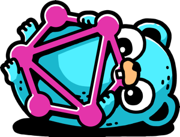

Hack the Valley 3 API
=====================
<p align="center">
  
</p>

[_powered by gqlgen_](https://gqlgen.com/)
## Instructions:
1. Install and configure Golang for your OS: [Here](https://golang.org/doc/install)
2. Clone this repository master branch
3. `cd` into the project root
4. Run the following commands to download the dependencies, 
verify them and vendor it locally for your projects:
    ```bash
    $ go mod download
    $ go mod tidy
    $ go mod verify
    $ go mod vendor
    ```
5. Run the following command to start up the graphql playground:
    ```bash
    $ go run ./server/server.go
    ```
6. Modify `resolver.go` as you go along to add/modify features.
7. For more information on how gqlgen works, check out the: [docs](https://gqlgen.com/getting-started/)